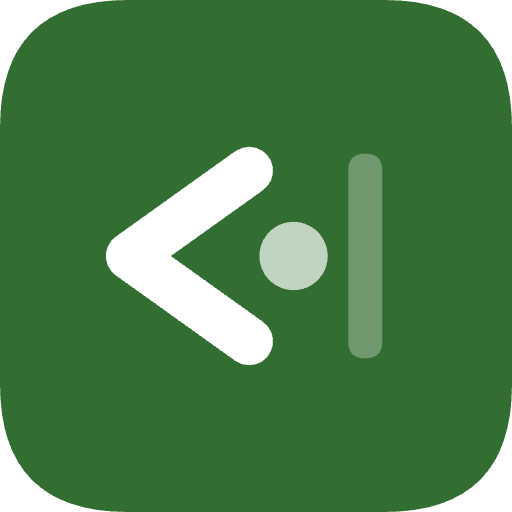

# EdgeX

> 向 `Xposed Edge` 致敬。`EdgeX` 是一个基于 LSPosed/Xposed 的 Android 手势增强模块，用于在屏幕边缘提供自定义手势触发、快捷动作和应用冷冻抽屉能力。

  

  
  
  

  <strong><a href="README.md">English</a></strong>

## 项目简介

`EdgeX` 通过 Hook `android` 与 `com.android.systemui` 进程，在系统输入链路中接管屏幕边缘手势，并把这些手势映射到系统动作、快捷方式或应用冷冻抽屉。

它不是普通意义上的独立 App。桌面图标仅用于配置模块行为，真正的手势识别和浮层能力运行在 LSPosed/Xposed 注入后的系统进程中。

## 当前特性

- 提供 6 个边缘分区，可分别配置和启用。
- 支持点击、双击、长按、上下滑等常用边缘手势。
- 可将手势映射为返回、桌面、最近任务、截图、快捷方式等动作。
- 内置 `Freezer` 与抽屉能力，可管理并快速启动已加入列表的应用。
- 提供调试矩阵、Arc Drawer 与 `Restart SystemUI` 等辅助功能。

## 工作原理

- 在 `android` 进程中 Hook `InputManagerService.filterInputEvent(...)`，拦截和识别边缘触摸事件。
- 在 `com.android.systemui` 进程中初始化浮层窗口、抽屉界面和部分 UI 动作执行能力。
- 配置通过 `ConfigProvider` 在宿主 App 与 Hook 进程之间同步。

如果你正在排查模块不生效的问题，优先确认 LSPosed 作用域是否正确，以及 `SystemUI` 是否已重启。

## 环境要求

### 必需条件

- Android 15 及以上
  - 当前构建配置：`minSdk = 35`
  - `compileSdk = 36`
  - `targetSdk = 36`
- 支持 Xposed API 82 的 LSPosed / Xposed 环境
- 已正确授予模块在 LSPosed 中的作用域：
  - `android`
  - `com.android.systemui`

### 与权限/Root 相关的说明

- `Freezer` 的冻结与解冻依赖 `su` 执行 `pm disable/enable`，通常需要 Root。
- 应用快捷方式读取优先走系统接口；若系统限制读取，模块会尝试通过 `dumpsys shortcut` 方式加载，这同样依赖 Root 能力。
- 部分动作是否可用，取决于系统 ROM、SELinux 策略以及 LSPosed 运行环境。

## 已测试环境

- Device: Pixel 9
- Android: 16
- LSPosed: `1.9.2-it(7455)`

这只是当前已验证环境，不代表仅支持这一组合。

## 安装与配置

### 1. 安装模块

可直接安装已编译 APK，或自行从源码构建后安装。

### 2. 在 LSPosed 中启用

启用 `EdgeX` 模块，并将作用域至少勾选为：

- `System Framework`（对应包名 `android`）
- `System UI`（对应包名 `com.android.systemui`）

### 3. 重启相关进程

推荐完整重启设备；如果只是调整配置，通常也可以：

- 使用 App 内的 `Restart SystemUI`
- 或手动重启 `SystemUI`

### 4. 配置手势

打开 `EdgeX` App 后，可以：

- 在主页面总开关中启用或禁用手势识别
- 进入 `Gestures` 页面配置六个分区
- 为每个手势事件选择具体动作
- 在 `Freezer` 页面管理冷冻应用列表

### Advanced Options

- `Debug Mode`：显示绿色触发区域，便于调试边缘范围。
- `Enable Arc Freezer`：启用弧形 Freezer Drawer 展示样式。
- `Restart SystemUI`：重启 `SystemUI`，让浮层和配置刷新更直接。

## License

本项目基于 [MIT License](LICENSE) 开源。

---

如果这个项目对你有帮助，欢迎提 Issue 或 PR 来一起完善它。
